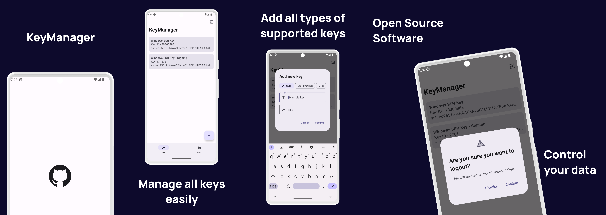

# KeyManager

<a href="https://play.google.com/store/apps/details?id=dev.yash.keymanager">
  
</a>
<a href="https://apt.izzysoft.de/fdroid/index/apk/dev.yash.keymanager">
  
</a>

An application to manage SSH and GPG keys on [GitHub](https://github.com/settings/keys) written in Kotlin.

Thanks to [FreePik](https://www.flaticon.com/free-icon/password_4370811) for the app icon.

## Screenshots



## Building

You will need to create a `Secrets.kt` file in `utils/`. This file will contain your GitHub OAuth app credentials. The format for this file is as given below:

```kotlin
object Secrets {
    const val CLIENT_SECRET = "your_client_secret"
    const val CLIENT_ID = "your_client_id"
    // DO NOT CHANGE [OAUTH_SCOPES] or [REDIRECT_URI]
    const val OAUTH_SCOPES = "admin:public_key admin:gpg_key read:public_key write:public_key"
    const val REDIRECT_URI = "dev.yash.keymanager://oauth2/callback"
}
```

> The OAuth Callback URL should be same as the `REDIRECT_URI` mentioned above.

## Third Party Libraries

- [openid/AppAuth-Android](https://github.com/openid/AppAuth-Android)
- [ChuckerTeam/chucker](https://github.com/ChuckerTeam/chucker)
- [dagger/hilt](https://dagger.dev/hilt/)
- [square/leakcanary](https://github.com/square/leakcanary/)
- [airbnb/lottie-android](https://github.com/airbnb/lottie-android)
- [square/moshi](https://github.com/square/moshi)
- [MoshiX/moshi-metadata-reflect](https://github.com/ZacSweers/MoshiX/tree/main/moshi-metadata-reflect)
- [square/okhttp](https://github.com/square/okhttp)
- [square/retrofit](https://github.com/square/retrofit)
- [JakeWharton/timber](https://github.com/JakeWharton/timber)

## License

```
Copyright (c) 2021 Yash Garg

Permission is hereby granted, free of charge, to any
person obtaining a copy of this software and associated
documentation files (the "Software"), to deal in the
Software without restriction, including without
limitation the rights to use, copy, modify, merge,
publish, distribute, sublicense, and/or sell copies of
the Software, and to permit persons to whom the Software
is furnished to do so, subject to the following
conditions:

The above copyright notice and this permission notice
shall be included in all copies or substantial portions
of the Software.

THE SOFTWARE IS PROVIDED "AS IS", WITHOUT WARRANTY OF
ANY KIND, EXPRESS OR IMPLIED, INCLUDING BUT NOT LIMITED
TO THE WARRANTIES OF MERCHANTABILITY, FITNESS FOR A
PARTICULAR PURPOSE AND NONINFRINGEMENT. IN NO EVENT
SHALL THE AUTHORS OR COPYRIGHT HOLDERS BE LIABLE FOR ANY
CLAIM, DAMAGES OR OTHER LIABILITY, WHETHER IN AN ACTION
OF CONTRACT, TORT OR OTHERWISE, ARISING FROM, OUT OF OR
IN CONNECTION WITH THE SOFTWARE OR THE USE OR OTHER
DEALINGS IN THE SOFTWARE.
```
